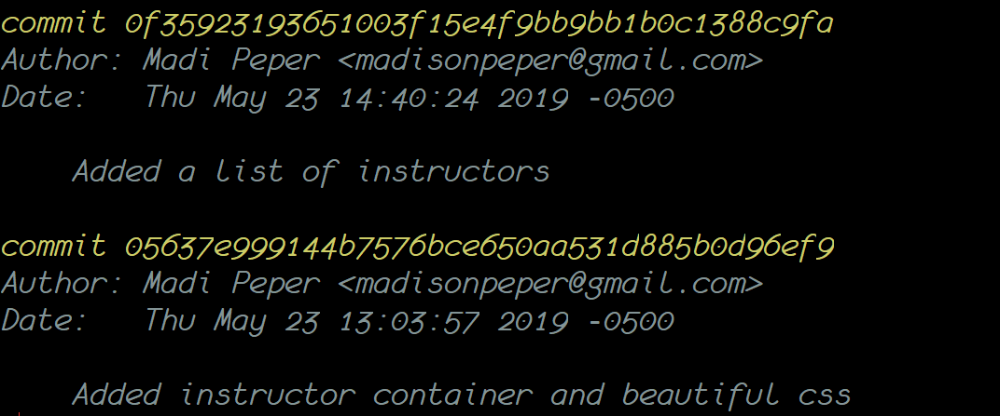
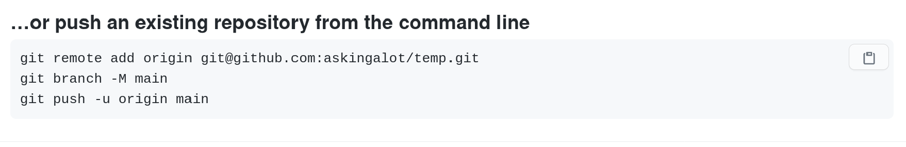

# Git and Github Basics

## Why Are You Learning This?

As a professional developer, you **will** be working on a team. Modern software development is a team sport, not an individual one. Teams members need the ability to write code independently, but then merge their individual code together when it's time to release a version of the software.

**Git** is the local tool on your computer that tracks the changes you make to files, allows a developer to work on an independent branch of the code base, and makes collaboration easier by allowing changes by multiple people to all be merged into one source.

**Github** is a code hosting platform for version control and collaboration, which allows you to easily share your code with other people, regardless of where they are located.

## Configure Git on Your Machine

### Git Version

Before we configure git, let's make sure your computer is up-to-date with a modern version. Run the following command.

```sh
git --version
```

You should see something like the following:

```sh
git version 2.29.2
```

Any version greater than `2.27` is sufficient. If you have a lesser version, you will need to upgrade. If you need to upgrade git, click [here](./GIT_UPGRADE.md).

### Configure Git
> **Note** We don't expect you to understand the following steps but we do need them all complete.

First configure git to use `main` as the default branch name.

```sh
git config --global init.defaultBranch main
```

Second, tell git who you are. You'll need to set a name and email in your global git `config` file. This makes it easy to know who committed code!



Third, use the following command, but instead of typing `Your Github User Name`, enter your Github account username.

```sh
git config --global user.name "Your Github User Name"
```

Fourth, use the following command, but instead of typing `email@example.com`, enter the email address you used when you created your Github account.

```sh
git config --global user.email "email@example.com"
```

Finally, tell git which _merge strategy_ to use when we do a `git pull`.

```sh
git config --global pull.rebase false
```


## Create a Git Repository

1. With terminal, use your newly created 
    ```sh
    cd ~/workspace/coffee-houses
    ```
1. Type in the `git init` command
1. You now have an empty git repository - meaning nothing has been tracked yet.

The magic is the `.git` directory that gets created when the `git init` command is executed. To see this directory you can use `ls -la`, which shows hidden files and directories. Operating systems will not show files and directories that begin with a period by default. They are considered hidden, or system assets.

> **Special Note** Most often you will want to ignore certain files within a directory and not track them with git. This can be accomplished by creating a .gitignore file and listing the items that should not be tracked. For example, anyone working with a Mac or collaborating with Mac users should ignore a file called `.DS_Store`.

> Create a `.gitignore` file. Put `.DS_Store` in the contents. 

> 👉 **Mac Users** Make a global .gitignore file and let `git` know you want to use this file for all of your repositories

```sh
echo .DS_Store >> ~/.gitignore_global

git config --global core.excludesfile ~/.gitignore_global
```


## Make Your First Commit

### Workflow to Remember

This is the process you will be following thousands of times while you are here at NSS. First you tell git which files to track and then you commit them with a message. 

Kinda like: "Hey git, add files A, B, and C to to this specific commit and this is why..."

```sh
git add --all
git commit -m "Message about commit"

```

### Commit Your Code

As you work on projects, adding the needed HTML, CSS, and/or JavaScript, you will find that there are moments when you want to preserve what you have written. It's not enough just to hit 'save' and move on, like you do in your favorite word processor. With git you will preserve snapshots of your code, called *commits*, that allow you to preserve a timeline of your progress. For practice exercises you may only make a single commit, but for larger assigments and certainly on full-blown applications you will end up making many commits over time.  

Before you can try making your first commit, you need to code to commit! Time to practice creating a new project with the bash functions you wrote in the previous chapter, and then tell git that you want to track all of your new files. Make sure you're in your `workspace` directory. Then create a project called `functions-practice`

```sh
mg functions-practice
```

Create the boilerplate files for it

```sh
simplehtml
```

You can open your code in VS Code to take a look to make sure everything was created properly

```sh
code .
```
If it all looks good and you're ready to preserve this code so you don't lose all your hard work ( just pretend you spent hours sweating over this project, ok? ), then it's time to track the changes by staging the files with the `add` command. This tells git that you want to add any changes since the last commit to the next commit you make. Since this is your first commit on this project, it will add all the files you just created.

```sh
git add --all
```

After `add` follow up with `status` to get a visual confirmation of what files are now ready to be committed. Please do this religiously after every `add` and `commit` while you're here at NSS. It will help you make sure that you're always adding and committing only the correct files and their changes. With git, taking things slow and confirming that each command worked properly will save you a TON of confusion and frustration. 

```sh
git status  
```

Still not done, though. You have only placed the files you want to commit in staging. Next you need to commit those changes with a message. This adds to the historical record of your project. The message you write should be short but clear. It needs to describe the state of the code at the moment of the commit. 

A project may contain multiple commits by the time you complete it. The commit messages should tell a story of the construction of your project. This will make a lot more sense later. For now, each time you commit just practice noting the changes you have made since the last commit.  

"Added nav bar", "Changed color scheme of home page", "Fixed bug in new customer form" are all examples of the kind of message you might add to a commit. For now, since this is the first commit and you only have some basic files, the following is perfectly fine  

```sh
git commit -m "initial commit of the functions practice exercise."
```

 > _Hint!_ If you accidentally type `git commit` and hit enter without the `-m` and the message, you'll be taken to a screen that will make you feel helpless. We have all done it. Get out of there with the following command. Make sure the bottom of the screen says `INSERT` somewhere. If not, type the letter `i` first. Then...

 ```sh
 :q!
 ```
> And then commit again

```sh
git status
```
If this is all too weird and scary, don't worry. Just grab an instructor and we will happily get you back to normal. Don't be embarassed. git is super intimidating and you'll mess up a million times before it starts to feel comfortable working with it.


## Back-Up and Share Code on Github

Now it's time to create a Github repository where you will upload your code. Github is a _software as a service_ (SAAS) that allows you to back-up your repository to the cloud and share it with other software developers. Note that it is not the same thing as `git`, which is an application you are running locally on your machine. Github and git are made to talk to each other, but they are separate entities. 

When you are ready to share your code with your teammates, or the general public, you can push your repository to Github. Think of Github as an external drive you plug into your laptop to use as back-up. Instead of it backing-up the entire hard drive, you will back things up, one project at a time, only when you want to.

The first thing you need to do is create a new repository on Github's platform.

### Create Github Repo and push your local commit(s) to Github

1. Log into your Github account.
1. Click the `+` sign in the top right corner.
1. Choose "New repository".
1. In the "Repository name" field, enter in `functions-practice`.
1. Scroll down and click the green "Create Repository" button. ( Be sure to skip all the other options. Leave the repo public and do not check any of the checkboxes )
1. From the on-screen instructions, follow the second set of instructions. Copy and paste the commands into your terminal, making sure you are still in the directory where you created your local git repo 
    

What does that do? It connects your local git repo to your remote Github repo and then pushes a copy of your code files to Github. Now that the code has successfully been uploaded, go back to your browser, and refresh the page. You will see your remote repository with the functions practice files. If not, don't panic. Find a teammate who got it to work and try to diagnose the problem. Call in an instructor if you hit any roadblocks. 

> Note: You will only need to run `git remote add origin` once per local-to-remote connection. But -- you will likely push your code up multiple times per project. More on that later!

> **Tip:** If you have any issues getting your code onto Github, see a member of the instruction team immediately. **Pushing your code to Github for every exercise and project is not optional. It's a required part of this program.**
