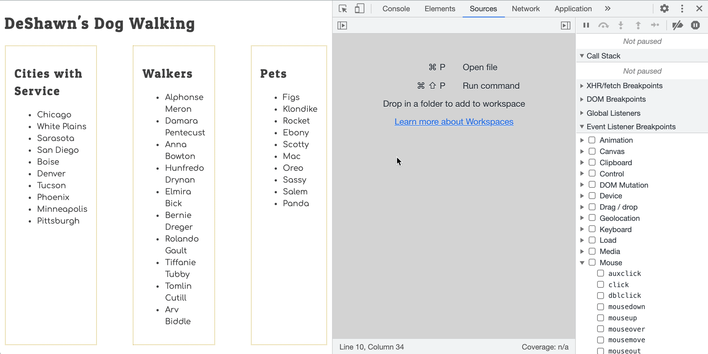

# Examining Events in the Dev Tools

You have started your journey on gathering evidence about your code and the way it operates by using the Developer Tools in Chrome.

Watch the <a href="https://vimeo.com/568120309">Dev Tools - Discovering and Debugging Events</a> video to explore a more advanced way to discover and debug eventListeners.

## Try it Out

Discover and debug the eventListener code you've created.

