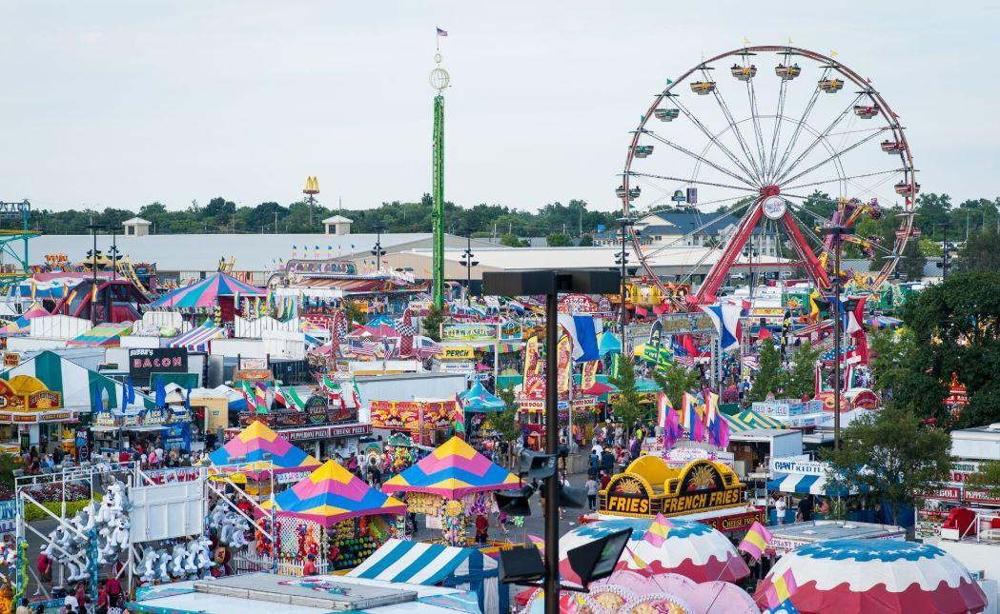
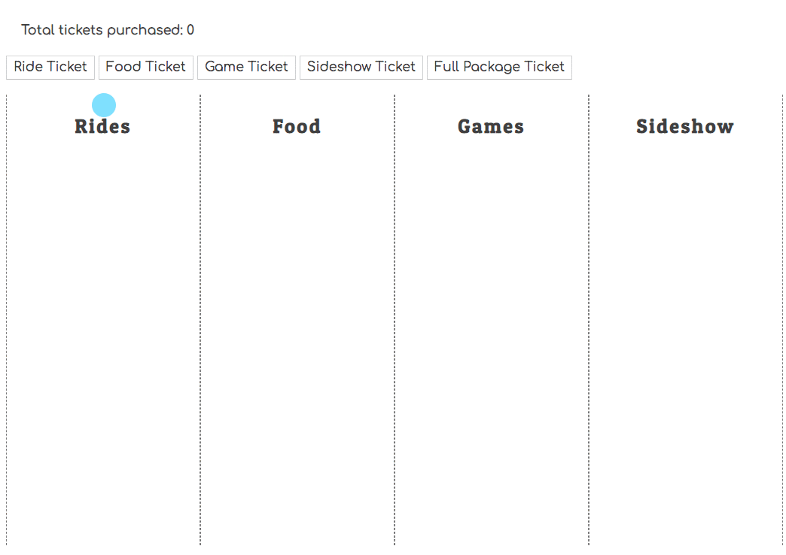

# State Fair Events

In this project, you are going to practice using `events` and `addEventListener()` to let users buy tickets to certain attractions at the state fair and then send the person to that area of the park.



## Setup

Open a new terminal window, copy pasta the following command into the terminal and hit enter to run it. It will create a basic file structure for you and create some starter code in the `~/workspace/statefair` directory.

```sh
/bin/bash -c "$(curl -fsSL https://raw.githubusercontent.com/nashville-software-school/client-side-mastery/master/book-2-glassdale-pd/chapters/scripts/statefair-install.sh)"
```

Then run the following command in your terminal to change directory to the project directory.

```sh
cd ~/workspace/statefair
```

Open the directory in Visual Studio Code. Then start the web server and follow the instruction in this project's chapters.

## End Goal

If you complete all of the chapters in this project, this is what your application will be able to do.




## Ticket Booth Component

1. In the `TicketBooth.js` component, add the following button as a child of the ticket booth `<div>`.
    ```html
    <button id="rideTicket">Ride Ticket</button>
    ```
1. In `main.js` add a click event listener on the content target element reference. Some starter code below.
    ```js
    eventHub.addEventListener()
    ```
1. In the body of the event listener callback function, check if the user clicked on the Ride Ticket button.
1. If so, create a an event that describes what happened. For example:
    ```js
    if (event.target.id == "rideTicket") {
    console.log("ride ticket clicked")
  }
    ```

1. Import and invoke the **`TicketBooth`** component function in `main.js`.